# IES Fight

## Trabajo Práctico Nº2 - Programación II

### Integrantes

- Serena Vargas
- Uriel Martinez
- Tomas Caballero
- Diego Caipe
---

# Descripción del juego

IES Fight es un videojuego de pelea en 2D desarrollado en Python utilizando la biblioteca Pygame.

El juego está basado en combates uno contra uno, donde los jugadores pueden controlar distintos personajes, realizar ataques, defenderse, utilizar objetos y participar en torneos.

El proyecto fue desarrollado aplicando conceptos de programación orientada a objetos, arquitectura modular y patrones de diseño, buscando crear un sistema organizado, escalable y fácil de mantener.

---

# Historia

En una institución donde la tecnología y la programación forman parte del día a día, surge una competencia diferente: IES Fight.

Los estudiantes, profesores y bedeles se enfrentan en intensos combates para demostrar sus habilidades, utilizando sus conocimientos y herramientas como sus principales armas.

Cada batalla representa un desafío donde la estrategia, los reflejos y el uso inteligente de los recursos pueden definir al ganador.

---

# Tecnologías utilizadas

Las principales tecnologías utilizadas en el desarrollo fueron:

- **Python:** lenguaje principal utilizado para la programación del juego.
- **Pygame:** biblioteca utilizada para la creación de la ventana, manejo de eventos, gráficos, sonidos y animaciones.
- **MySQL:** utilizado para almacenar la información persistente de los torneos.
- **Git / GitHub:** utilizados para el control de versiones y organización del trabajo en equipo.

---
## Configuración de la app

Antes de ejecutar la aplicación, debes configurar las siguientes variables de entorno:

```env
DB_USER=<tu_usuario>
DB_PASSWORD=<tu_contraseña>
DB_NAME=<nombre_de_la_base>
DB_HOST=<host_de_mysql>
DB_PORT=<puerto_de_mysql>
```
---

## Requisitos

- Python 3.10 o superior
- MySQL

## Cómo ejecutar el proyecto

### 1. Clonar el repositorio
```bash
git clone https://github.com/caipediego541-star/game-project.git
```

### 2. Ingresar al repositorio
```bash
cd game-project
code .
```

### 3. Instalar las dependencias
```bash
pip install -r requirements.txt
```

### 4. Ejecutar la aplicación
```bash
python main.py
```
# Capturas del juego

## MENU PRINCIPAL
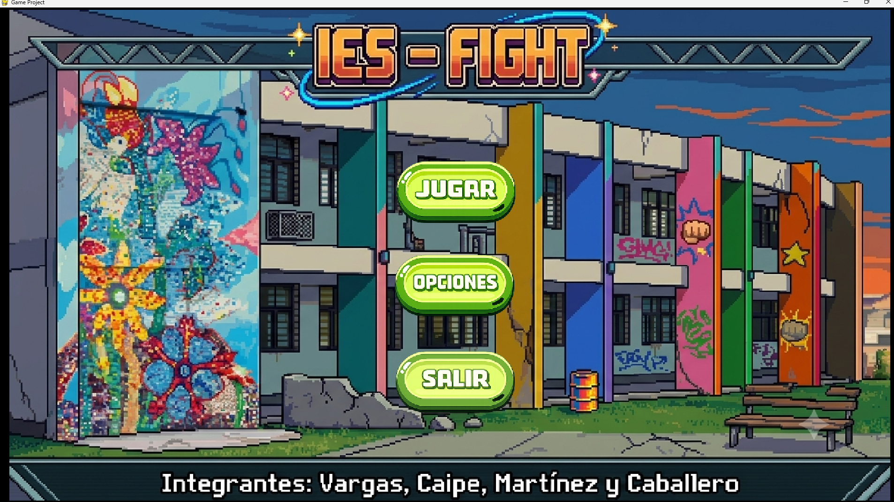
## opciones
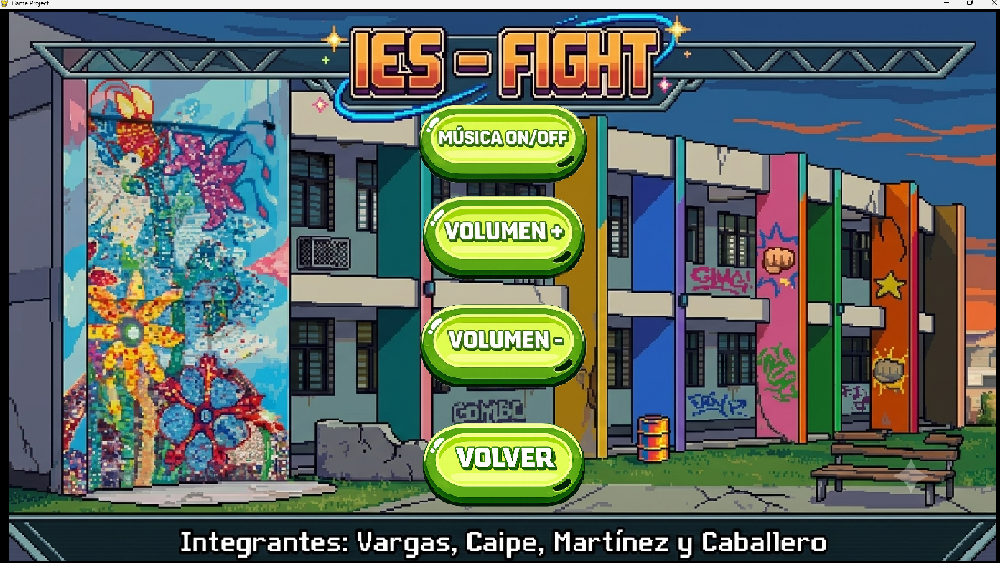
## Musica activada
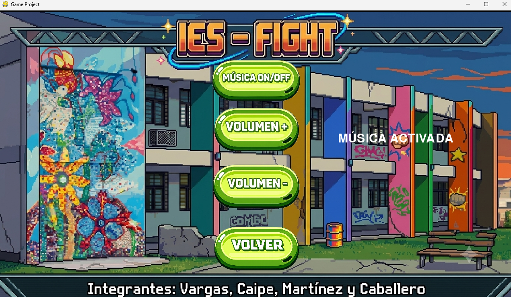
## Musica desactivada
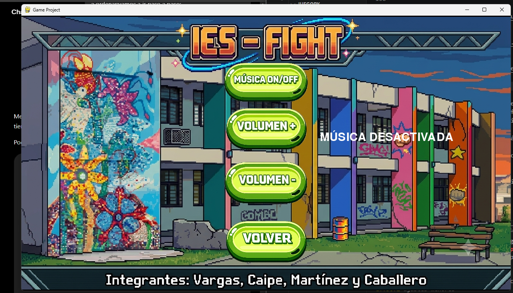
## Bajar volumen
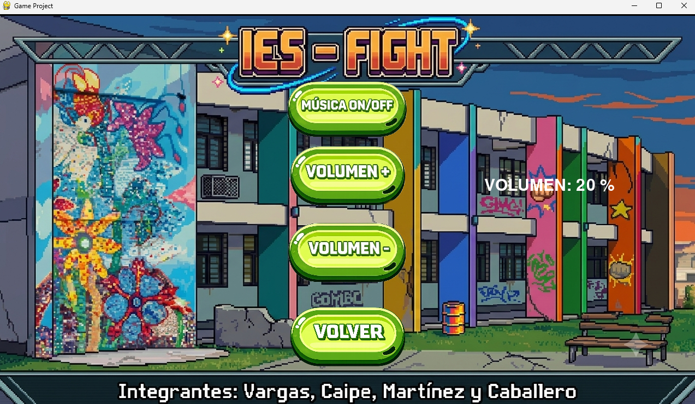
## Subir volumen
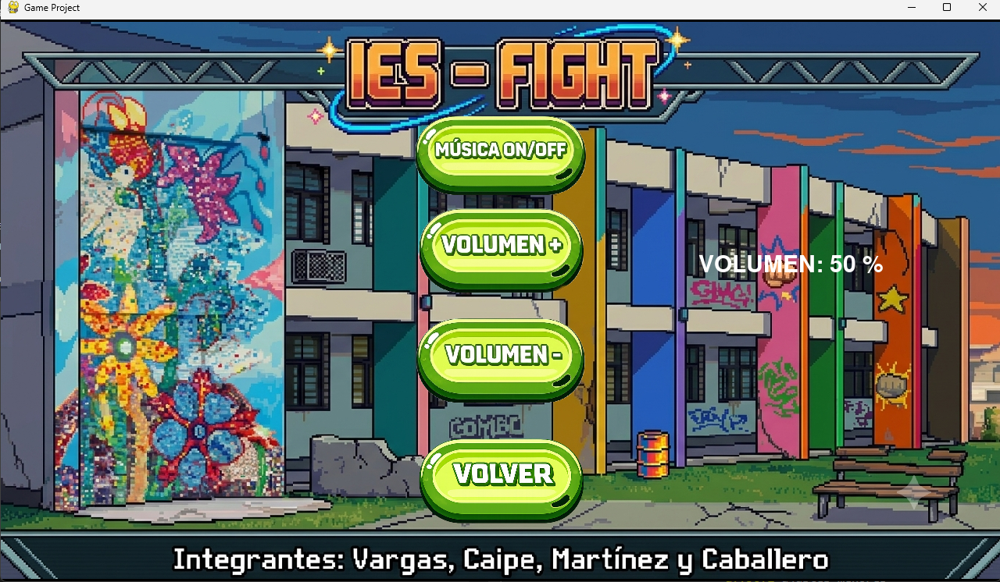
## Menú peleas
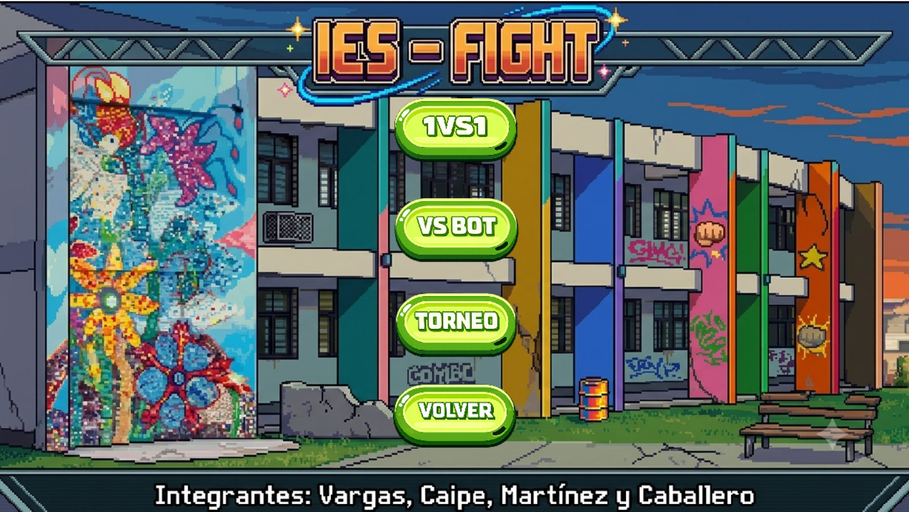

## Cargar Torneo
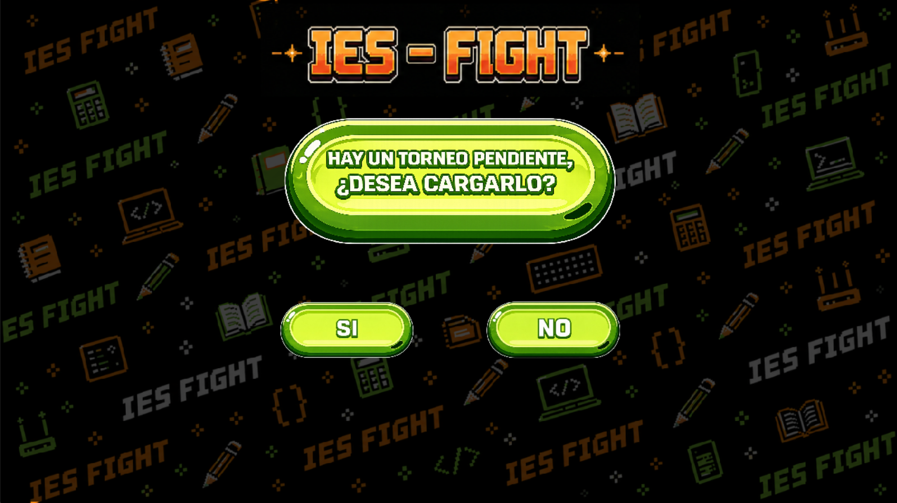

## Menú de dificultad
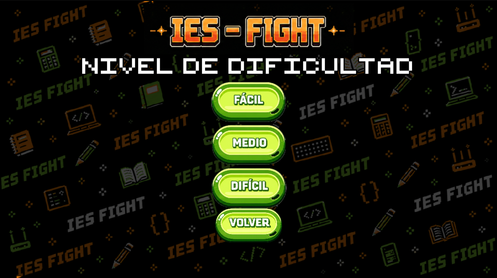

## Menú Pausa
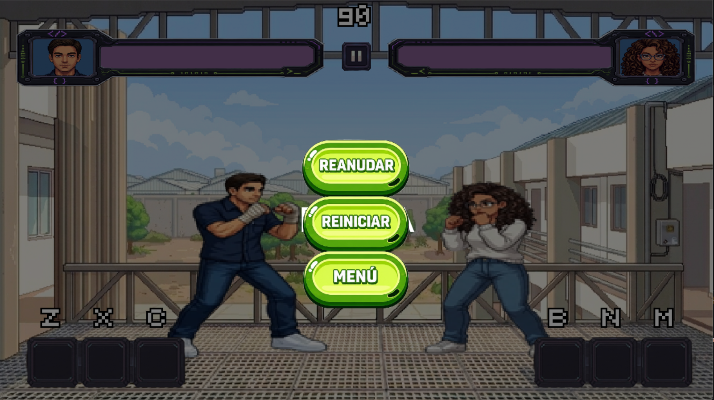

## Selección personajes
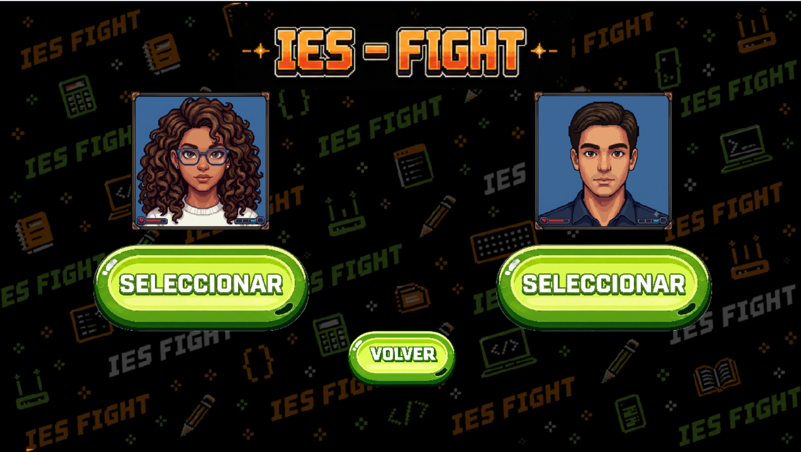

## Torneo
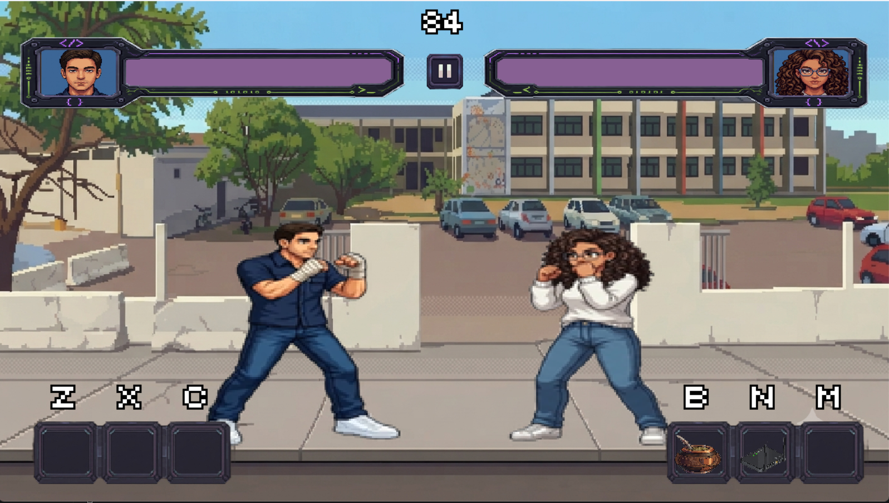

## Selección de mapa
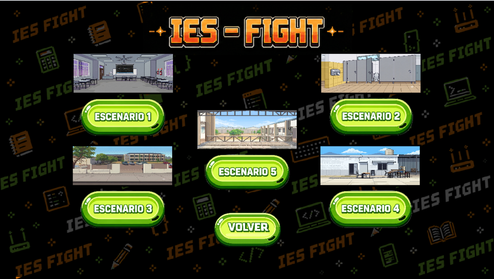

# Base de datos

El juego utiliza MySQL como sistema de almacenamiento persistente para conservar la información de los torneos incluso después de cerrar la aplicación.

Actualmente la base de datos está compuesta por una única tabla llamada `torneo`, ya que los requerimientos del proyecto solo necesitan almacenar el progreso de las competencias.

La tabla `torneo` contiene los siguientes campos:

| Campo | Tipo | Descripción |
|---|---|---|
| id | INT | Identificador único del torneo. Es la clave primaria de la tabla. |
| jugador1 | VARCHAR(50) | Nombre del primer jugador participante. |
| jugador2 | VARCHAR(50) | Nombre del segundo jugador participante. |
| victorias_jugador1 | TINYINT | Cantidad de victorias obtenidas por el jugador 1. |
| victorias_jugador2 | TINYINT | Cantidad de victorias obtenidas por el jugador 2. |
| ronda_actual | TINYINT | Indica la ronda actual del torneo. |
| estado | ENUM | Estado actual del torneo (`EN_CURSO` o `FINALIZADO`). |

# Comandos

## Jugador 1

| Acción | Tecla | 
|---|---| 
| Mover hacia la izquierda | A | 
| Mover hacia la derecha | D | 
| Saltar | W | | Golpe | F | 
| Patada | G | 
| Bloquear | H | 
| Usar objeto 1 | Z | 
| Usar objeto 2 | X | 
| Usar objeto 3 | C | 
| Responder cuestionario | Click izquierdo | 

## Jugador 2

| Acción | Tecla | 
|---|---| 
| Mover hacia la izquierda | Flecha izquierda ← | 
| Mover hacia la derecha | Flecha derecha → | 
| Saltar | Flecha arriba ↑ | 
| Golpe | J | 
| Patada | k | 
| Bloquear | L | 
| Usar objeto 1 | B | 
| Usar objeto 2 | N | 
| Usar objeto 3 | M | 
| Responder cuestionario | Click izquierdo | 

# Patrones implementados 

## Singleton

El patrón Singleton se implementó en la clase SoundManager. Su objetivo es garantizar que exista una única instancia encargada de administrar la reproducción de la música y los efectos de sonido del juego. 

## Factory Method 

Se implementaron fábricas para la creación de jugadores, ítems y botones de la interfaz. De esta manera, la lógica de construcción queda centralizada en clases específicas, facilitando la incorporación de nuevos tipos de objetos sin modificar el código que los utiliza. 
## Observer 

El patrón Observer fue implementado para notificar automáticamente los cambios producidos en la vida de los jugadores. Cuando el estado de salud de un personaje cambia, los componentes suscritos reciben una notificación y actualizan la información correspondiente. Esto permitió mantener sincronizada la interfaz gráfica con el estado del juego sin generar dependencias directas entre ambos componentes.

## State

El patrón State se utilizó para representar los diferentes estados del juego, como el menú principal, el combate, la pausa y las pantallas de resultados. Cada estado encapsula su propia lógica de actualización y representación gráfica. 

## Strategy 

El patrón Strategy se implementó para gestionar el comportamiento del bot. Mediante estrategias intercambiables, el sistema permite definir la lógica de actuación del personaje controlado por la computadora sin modificar la estructura principal del juego. 

## Command 

El patrón Command se empleó para gestionar las acciones ejecutadas por los jugadores a través del teclado. Cada acción, como caminar, saltar, atacar o bloquear, se encuentra encapsulada en un comando independiente. 

## Decorator 

El patrón Decorator se utilizó para otorgar diferentes comportamientos a los ítems del juego sin modificar su estructura base. Cada decorador añade una funcionalidad específica, permitiendo que distintos objetos produzcan efectos diferentes al ser utilizados por el jugador. 

## Repository 

El patrón Repository se implementó para gestionar el acceso a la información de los torneos almacenada en la base de datos MySQL. Su función es actuar como intermediario entre la lógica del juego y la capa de persistencia, encapsulando las operaciones de almacenamiento, consulta, actualización y eliminación de datos.


